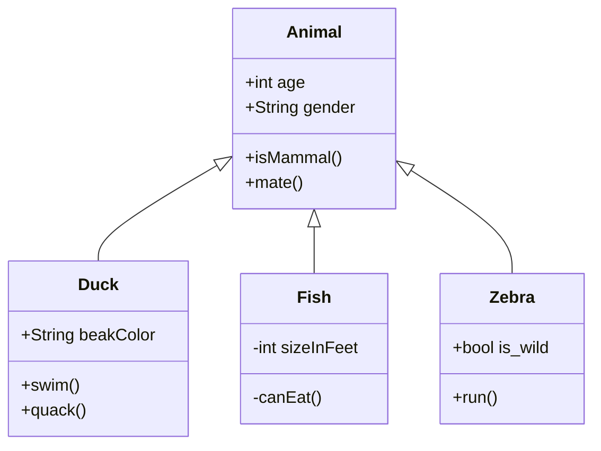

# Risk_Game

# Table of Contents

- [Review](#Review)
  - [Requirments](#Requirments)
- [Design Overview](#Design-Overview)
  - [UML Diagram](#UML-Diagram)
- [Implementation](#Implementation)

## Review

### Requirments

## Design Overview

### UML Diagram

## Implementation
