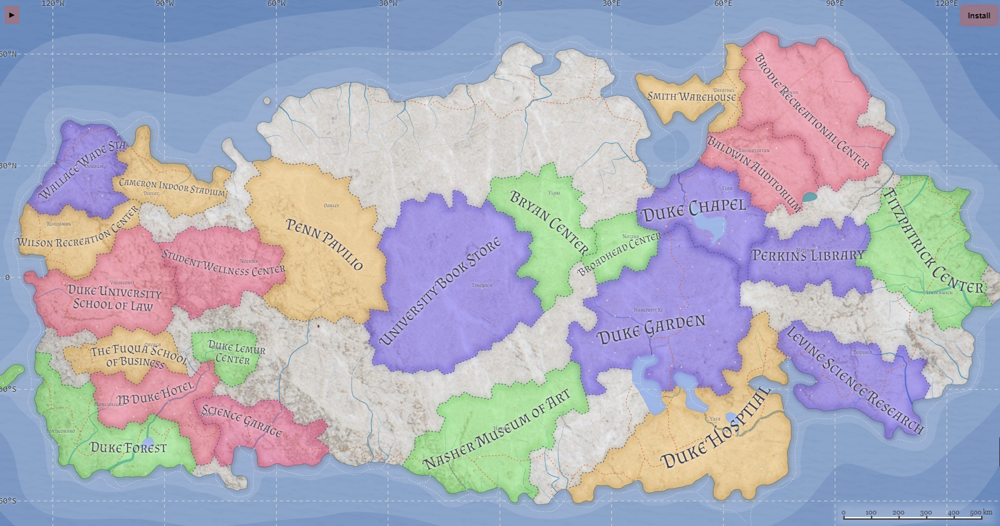
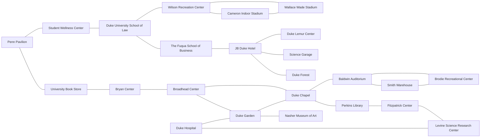
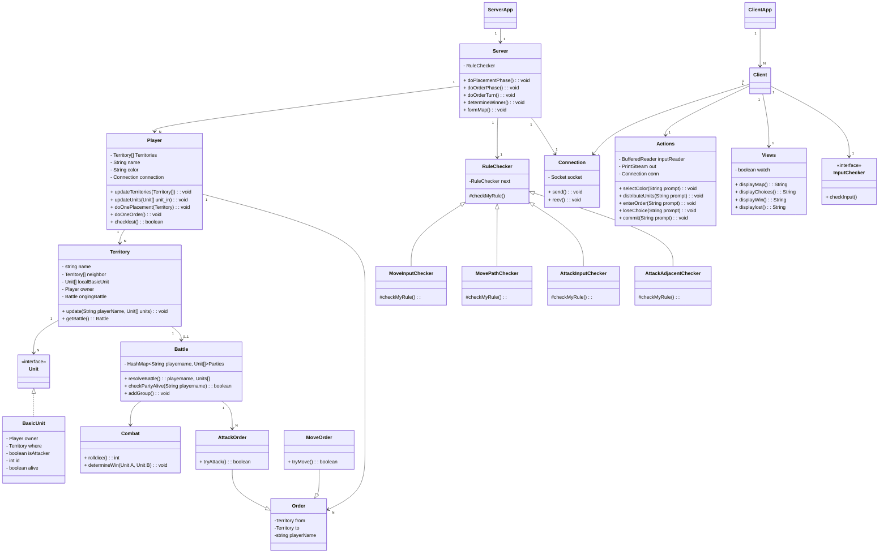

# Risk_Game

# Table of Contents
- [Coverage](#Coverage)
- [Schedule](#Schedule)
- [Requirements](#Requirements)
- [Game Detail](#Game-Detail)
  - [Duke Map](#Duke-Map)
  - [Map initialization](#Map-initialization)
  - [Unit initialization](#Unit-initialization)
  - [Resource and Tech Level initialization](#Resource-and-Tech-Level-initialization)
  - [Action Costs](#Action-Costs)
- [Design Overview](#Design-Overview)
  - [UML Diagram](#UML-Diagram)
  - [UI Prototype](#UI-Prototype)

## Coverage
[Detailed coverage](https://zf70.pages.oit.duke.edu/Risk_Game/dashboard.html)

## Schedule
* Evolution 1: 2/24 - 3/24
* Evolution 2: 3/24 - 4/10
* Evoluiton 3: 4/10 - 4/28

[Project Mamagement Sheet](https://docs.google.com/spreadsheets/d/1B2cUguqBPXm3IJBRU1WRPnoBng4p8AiTouAkxmXUhYg/edit#gid=0)

## Requirements
[Evolution1](prj1.pdf)
Evolution2

## Game Detail
### Duke Map

### Map initialization
The duke map is initialized with 24 territories. This game supports 2-4 players. For 2 players, each player will have 12 territories, and can choose from colors: red, blue. For 3 players, each player will have 8 territories, and can choose from colors: red, blue, yellow. For 4 players, each player will have 6 territories, and can choose from colors: red, blue, yellow, green. For each pair of adjacent territories, the distance between them is 5.

### Unit initialization
The player each has 24 Freshman units(level 0) at the start of the game to assign to their territories. There is a total of 7 level of units: Freshman(level 0), Sophomore(level 1), Junior(level 2), Senior(level 3), Master(level 4), phD(level 5), Professor(level 6). Each territory will generate 1 Freshman unit(level 0) at the beginning of a new turn.

### Resource and Tech Level initialization
Each territory produces 5 food resources and 5 tech resources per turn. Each player starts with a tech level 1, and can upgrade per turn till tech level 6.

### Action Costs
Attack and move actions cost food resources.
* Attack cost = 8 * numUnits
* Move cost =  distance * numUnits

Research and upgrade actions cost tech resources.
* Research Cost Table

| Upgrade Level | Cost |
| ------------- | ---- |
|     1->2      |  20  |
|     2->3      |  40  |
|     3->4      |  80  |
|     4->5      |  160 |
|     5->6      |  320 |

* Upgrade Cost+Bonus Table

| Cost (Total) | Bonus | Tech Level Required |
| ------------ | ----- | ------------------- |
|     0(0)     |   0   |   Units Start Here  |
|     3(3)     |   1   |          1          |
|     8(11)    |   3   |          2          |
|    19(30)    |   5   |          3          |
|    25(55)    |   8   |          4          |
|    35(90)    |   11  |          5          |
|    50(140)   |   15  |          6          |

## Design Overview
### UML Diagram

### UI Prototype
<video src="Resources/RiskGameUIDesign.mp4" width="600px">

