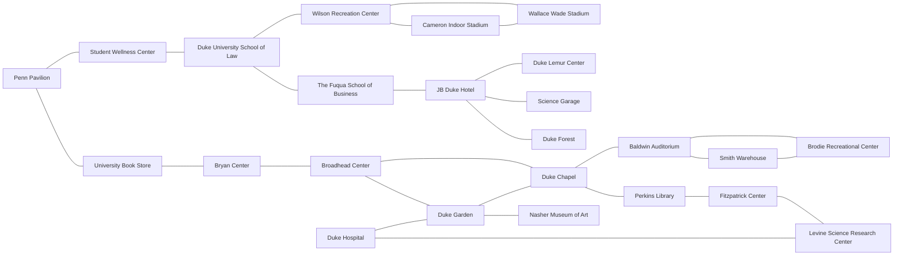

# Risk_Game

## Coverage
[Detailed coverage](https://zf70.pages.oit.duke.edu/Risk_Game/dashboard.html)

# Table of Contents
- [Schedule](#Schedule)
- [Review](#Review)
  - [Requirements](#Requirements)
- [Design Overview](#Design-Overview)
  - [UML Diagram](#UML-Diagram)
- [Implementation](#Implementation)

## Schedule
* Evolution 1: 2/24 - 3/24
* Evolution 2: 3/24 - 4/10
* Evoluiton 3: 4/10 - 4/28

[Project Mamagement Sheet](https://docs.google.com/spreadsheets/d/1B2cUguqBPXm3IJBRU1WRPnoBng4p8AiTouAkxmXUhYg/edit#gid=0)

## Review

### Requirements
test test
See requirements in [prj1.pdf](prj1.pdf)

## Design Overview

MoveInputChecker and AttackInputChecker should:
- check units > 0 
- check source territory is your.
- check destinination territory is your.

### UML Diagram

### UML Description
Some important details:

| Class  | Method | Description |
| ------------- | ------------- | ------------- |
| Server | doPlacementPhase() | 1. assign territories into N groups and through recv() get player's choice of color.  2. assign each player the same number of units |
|^      | doOrderPhase() | game main phase: order, order, order..... |
|^      | doOrderTurn() | 1. Move + Attack  2. after completing all actions, add 1 unit to each territory |
| Player | updateUnits() | update units in territory |
| Territory | ongoingBattle(): Battle | SingleTon pattern |
| ^         | getBattle(): Battle | If Battle exists, return Battle, otherwise, create it |
| Combat | determineWin(Unit unit1, Unit unit2)| |
| Battle | resolveBattle(): vector<string Name, Unit[] units[]>| Battling in a circle list|

## Implementation
Duke Map

